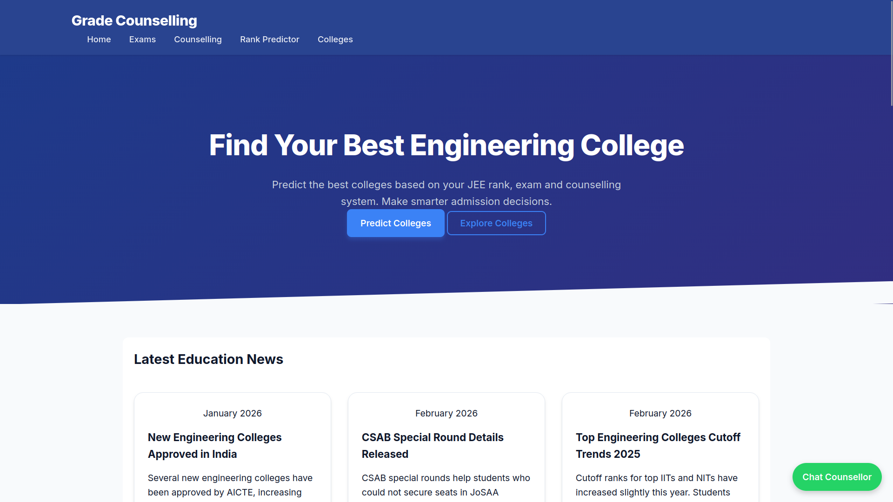
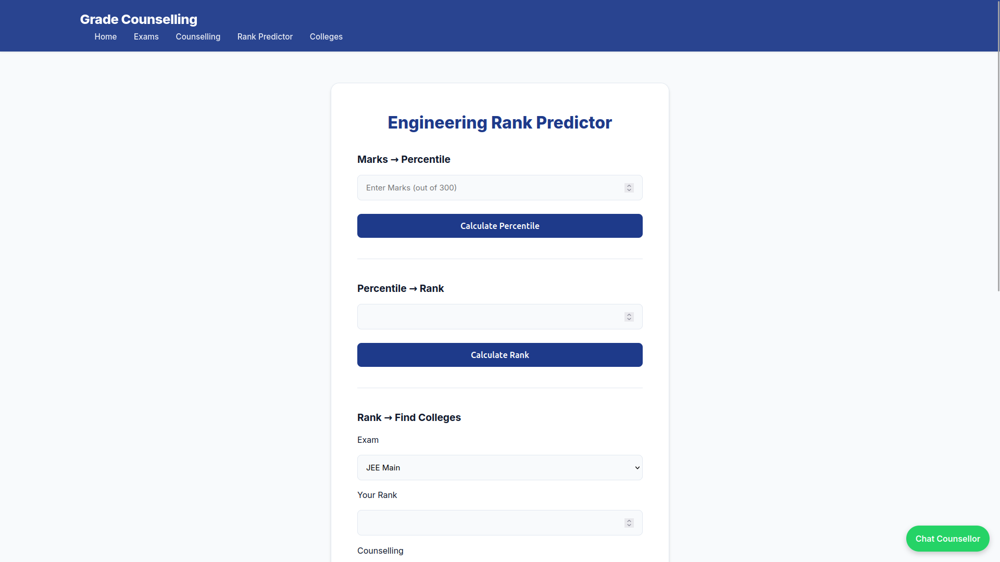
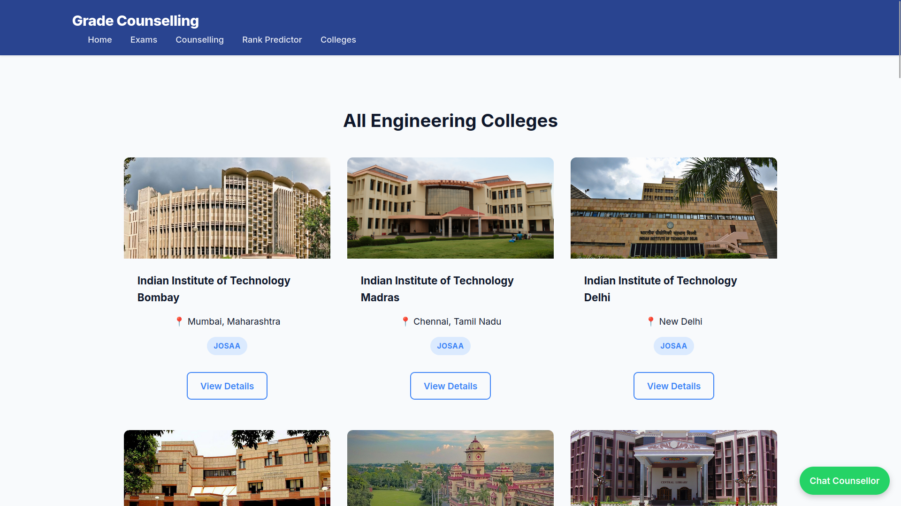
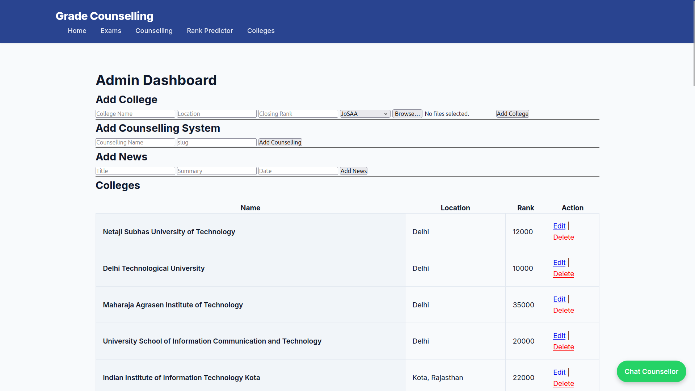

# 🎓 Grade Counselling System (Flask Project)


## 🚀 Live Demo

👉 https://grade-counselling.onrender.com/

---

## 📌 Project Overview

The **Grade Counselling System** is a web-based platform that helps students find the best engineering colleges based on their rank, marks, and counselling system (JoSAA, UPTAC, JAC Delhi, etc.).

It also includes an **admin panel** for managing colleges, counselling data, and news.

---

## 🚀 Features

### 👨‍🎓 Student Side

* 🎯 College Finder (rank, exam, counselling based)
* 📊 Marks → Percentile conversion
* 📉 Percentile → Rank conversion
* 🏫 View all colleges
* 📄 College details page
* 🧾 Entrance exam information
* 📰 Latest news updates

### 🛠️ Admin Side

* 🔐 Secure login system
* ➕ Add / ✏️ Edit / ❌ Delete colleges
* 🖼️ Upload college images
* 📊 Manage counselling systems
* 📰 Add / Edit news articles
* 📊 Dashboard overview

---

## 🛠️ Tech Stack

### 🔹 Backend

* Python 3
* Flask
* SQLite

### 🔹 Frontend

* HTML5
* CSS3
* JavaScript

### 🔹 Tools

* Jinja2 (templating)
* Werkzeug (file handling)
* Virtual Environment (venv)

---

## 📸 Screenshots

### 🏠 Home Page



### 🔍 College Finder



### 🏫 College Details



### 🛠️ Admin Dashboard



---

## 📂 Project Structure

```
grade-counselling/
│
├── app.py
├── init_db.py
├── database/
│   └── colleges.db
│
├── modules/
│   ├── colleges.py
│   ├── db.py
│   ├── exams.py
│   ├── predictor.py
│
├── templates/
│   ├── base.html
│   ├── home.html
│   ├── finder.html
│   ├── college.html
│   ├── college_detail.html
│   ├── counselling.html
│   ├── exam.html
│   ├── exam_detail.html
│   ├── news.html
│   ├── news_detail.html
│   ├── admin.html
│   ├── admin_dashboard.html
│   └── edit_*.html
│
├── static/
│   ├── css/style.css
│   ├── js/
│   └── images/
│       └── screenshots/
│
└── venv/
```

---

## 🧠 How the System Works

### 1. Flask Application

* Handles routes and logic
* Connects frontend with backend
* Manages admin sessions

### 2. Database

* SQLite (`colleges.db`)
* Stores colleges, exams, counselling, news

### 3. Prediction Logic

* Matches colleges where:
  `closing_rank >= student_rank`

---

## 🔄 College Finder Flow

1. User inputs rank, exam, counselling
2. Backend calls `predict_colleges()`
3. Database is queried
4. Results displayed on UI

---

## 🔐 Authentication

* Session-based login
* `session["admin_logged_in"]`

---

## ▶️ Installation & Setup

```bash
git clone https://github.com/mfhaque0/grade-counselling.git
cd grade-counselling
pip install -r requirements.txt
python app.py
```

Open in browser:

```
http://127.0.0.1:5000
```

---

## 📌 Future Improvements

* 🤖 AI-based recommendations
* 👤 User login system
* 🎯 Advanced filters
* 🎨 UI improvements

---

## 🤝 Contributing

Feel free to fork and submit pull requests.

---

## 📧 Contact

* Email: [info@gradecounselling.com](mailto:info@gradecounselling.com)
* Location: Lucknow, India

---

## ⭐ Support

If you found this project helpful, give it a ⭐ on GitHub!

---
